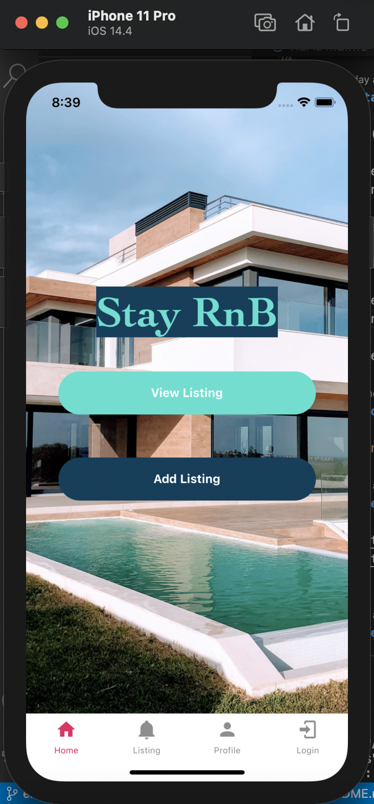
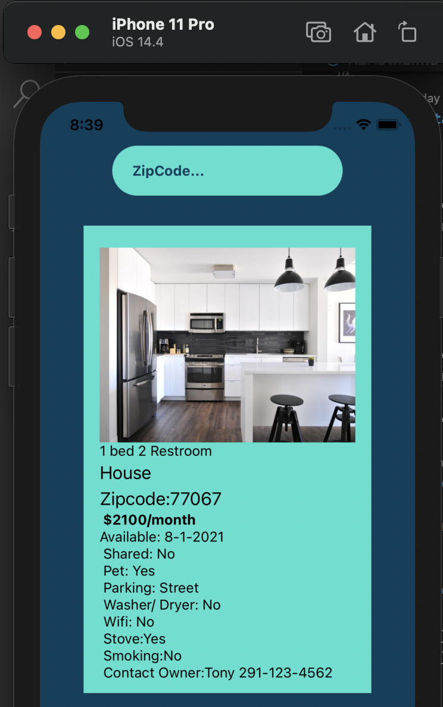
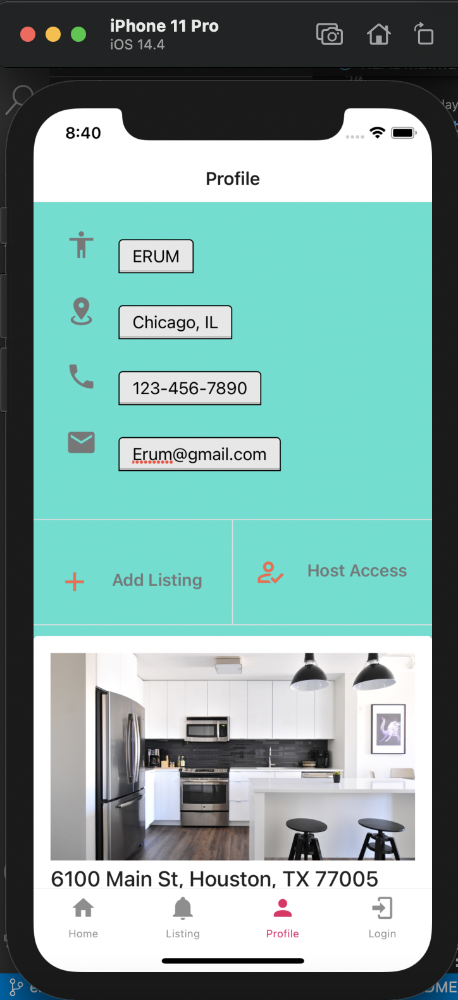
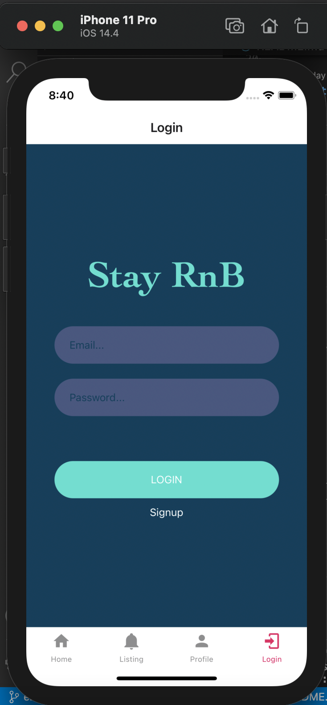

# Stay-RnB-Mobile

## Description

This is an application for booking room and boarding for rent. When you are looking for the minimum place to stay and sleep without the hassle of paying for full apartments or houses, we are here to solve your problem. Our application will connect the user with property owners that will host their available rooms for boarding. Property owners who have spare bedrooms they want to rent out to users. 

This is a mobile app for users to use to view and post listings. 

## Table of Contents

- [Installation](#installation)
- [Deployment](#deployment)
- [User Story](#userstory)
- [Team Members](#teammembers)
- [Credits](#credits)
- [Resources](#resources)
- [License](#license)

## Installation

Part 1 (Backend Repo)

1. Clone repo.
2. Cd into directory.
3. "Npm install"
4. In terminal "npm run watch" OR "node server.js"

Part 2 (Mobile) Repo)

1. Clone repo.
2. Cd into directory.
3. "Npm install"
4. In terminal "npm start" OR "expo start"

# Deployment

## Mobile Version

Expo: https://expo.io/@erumdhukka/projects/stayrnb
Repo: https://github.com/erumd/Stay-RnB-Mobile
Backend Repo: https://github.com/erumd/Stay-RnB-Mobile-Backend

## Web Version

Repo: https://github.com/code-monkey713/Stay-RnB-Web
Web Deployment: https://stay-rnb.herokuapp.com/

## Server-Side

Repo: https://github.com/Joeseff6/Stay-RnB-Backend
Server Deployment: https://stay-rnb-server.herokuapp.com/

# User Story

AS A owner
I WANT a post listing
SO THAT users can find a room and board as they travel

AS A User
I WANT to find a place for room and board as I travel

# Team Members

Erum Dhukka - Mobile application development

- GitHub: https://github.com/erumd
- Email: erumdhukka531@gmail.com

Joseph Soria - Server-side development

- Deploy: https://stay-rnb-server.herokuapp.com/
- GitHub: https://github.com/Joeseff6
- Email: josephsoria6@gmail.com

Tony Tran - Desktop/React application development/Project Manager

- GitHub: https://github.com/Joeseff6
- Email: josephsoria6@gmail.com

# License

MIT License

    Copyright (c) [2021]

    Permission is hereby granted, free of charge, to any person obtaining a copy
    of this software and associated documentation files (the "Software"), to deal
    in the Software without restriction, including without limitation the rights
    to use, copy, modify, merge, publish, distribute, sublicense, and/or sell
    copies of the Software, and to permit persons to whom the Software is
    furnished to do so, subject to the following conditions:

    The above copyright notice and this permission notice shall be included in all
    copies or substantial portions of the Software.

    THE SOFTWARE IS PROVIDED "AS IS", WITHOUT WARRANTY OF ANY KIND, EXPRESS OR
    IMPLIED, INCLUDING BUT NOT LIMITED TO THE WARRANTIES OF MERCHANTABILITY,
    FITNESS FOR A PARTICULAR PURPOSE AND NONINFRINGEMENT. IN NO EVENT SHALL THE
    AUTHORS OR COPYRIGHT HOLDERS BE LIABLE FOR ANY CLAIM, DAMAGES OR OTHER
    LIABILITY, WHETHER IN AN ACTION OF CONTRACT, TORT OR OTHERWISE, ARISING FROM,
    OUT OF OR IN CONNECTION WITH THE SOFTWARE OR THE USE OR OTHER DEALINGS IN THE
    SOFTWARE.
